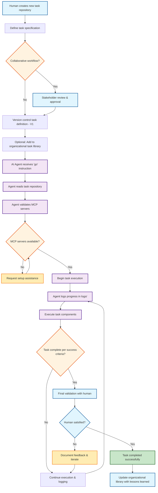

# AI Agent Task Repo Pattern - With MCP Definition

This repository demonstrates a structured pattern for defining specific tasks for AI agents, whether deployed on remote servers or local environments. 

The intended use-case here is using agentic IDE tools for systems administration, dev-ops etc: 

In other words, leveraging chat interfaces like Cascade (by Windsurf) as a communications layer similar to a CLI (ie a chat interface). But rather than having them work on code repos, having the agents work, primarily, on operating on filesystems via executing SSH operations.

Defining a repository for each major task you are working on may seem tedious but brings with it many benefits (beyond and including those of robust version control):

- Context for the project can be gathered into an organised context folder.  
- Logs can be gathered within the repo. Compared to the traditional approach of gathering 'memories' within a repository, this approach supports collaborative repository work: memories can be aggregated and are not tied to a graph database hosted on any one worksation. 
- A secrets file (`secrets.md`) does not provide secrets (which of course would be unsafe) but guides the agent on what tools to use in order to access secrets securely, per the user's preferences. This may be as simple as saying ("use .env") or define the CLI that the agent should interact with in order to use a formal secrets store. 

The guiding principle of this approach is what I have learned so far using tools like Windsurf (et al) almost every day for the past ... year:

1) Task modularisation is key. Asking agents to execute multi-step tasks is getting easier thanks to innovations like planning support. However, the default position remains that the best results are currently seen when agents execute single well-defined task. This repo template simply aims to embody that in a formal templateable repo pattern. 

2) The state of AI code gen in 2025 is highly fluid. Developers (or AI co-developers!) tend to play around with different LLMs as they come to market. A templated logging system (it can be as simple as "write out a summary of what we did today and wher we are up to") becomes highly valuable for facilitating easy handoff of tasks between agents backed by compeltely different LLMs.

---

## Intended Use / Workflow

1: The user (human) creates a new task repository and works on a tightly defined spec for the development / sysadmin task. This template can be expanded upon. For example, you may with to include guardrails or filesystem rules or include details about CI/CD processes to be followed.

2: In collaborative workflows, stakeholders can review and approve upon the task definition. 

3: Task is version controlled (V1). In the organisational context, an organisation may wish to consider aggregating these task definitions into libraries that users can draw down from in order to save time. Users can include notes in the repo about what worked and what didn't enabling continuous improvement processes.

4: AI agent gets the 'go' instruction. At its most simple level this can be a prompt like: "I have defined a new task for you at /task-repo-path. Please read the instructions carefully and begin working on the project."

5: Observation and feedback. 

 
## Repository Structure

| Component | File | Description |
|-----------|------|-------------|
| **Task Overview** | [`tasks/project-outline.md`](repo-template/tasks/project-outline.md) | High-level overview of the project and main requirements |
| **Implementation Details** | [`tasks/details.md`](repo-template/tasks/details.md) | Specific technical details, configurations, and supplementary information |
| **Remote Environment** | [`tasks/remote.md`](repo-template/tasks/remote.md) | Target server/environment specifications and access details |
| **Authentication & Secrets** | [`tasks/secrets.md`](repo-template/tasks/secrets.md) | Security credentials and authentication mechanisms |
| **MCP Configuration** | [`tasks/mcp.md`](repo-template/tasks/mcp.md) | Required MCP servers and their configurations |
| **Success Criteria** | [`tasks/success.md`](repo-template/tasks/success.md) | Clear, measurable criteria for task completion |
| **Progress Logs** | [`tasks/logs/`](repo-template/tasks/logs/) | AI agent logs for tracking progress and debugging |

## How to Use This Template

1. **Clone this repository** as a starting point for your AI agent task
2. **Customize each component** with your specific project requirements:
   - Update `project-outline.md` with your task overview
   - Fill in `details.md` with technical specifications
   - Configure `remote.md` with your target environment
   - Set up `secrets.md` with your authentication approach
   - Define `success.md` with measurable completion criteria
3. **Deploy or share** the repository with your AI agent
4. **Monitor progress** through the logs directory

## Template Components Explained

### Project Outline
The foundation document that provides the AI agent with a comprehensive understanding of what needs to be built or accomplished. This should include functional requirements, user interface specifications, and architectural considerations.

### Details
Supplementary technical information that supports the main outline. This includes API endpoints, configuration values, specific libraries or frameworks to use, and any other implementation-specific details.

### Remote Environment
Specifications for the target deployment environment, including IP addresses, server configurations, access methods, and any environment-specific constraints or requirements.

### Secrets Management
A secure approach to providing the AI agent with necessary credentials and API keys. This document outlines the authentication mechanism without exposing sensitive information directly in the repository.

### MCP Configuration
Defines the Model Context Protocol (MCP) servers required for the task. MCP servers extend AI agent capabilities by providing access to specialized functions, external services, and tools needed for task completion.

### Success Criteria
Measurable, specific criteria that define when the task is complete. This prevents scope creep and provides clear validation points for both the AI agent and the human supervisor.

### Progress Logs
A dedicated space for the AI agent to document its progress, decisions, challenges encountered, and solutions implemented. This creates an audit trail and helps with debugging if issues arise.

## Example Use Case

The template includes an example NVR (Network Video Recorder) system implementation that demonstrates:
- Multi-camera RTSP feed integration
- Fault-tolerant design patterns
- Real-time status monitoring
- User interface requirements
- Remote deployment considerations

## Best Practices

- **Be Specific**: Vague requirements lead to suboptimal results
- **Include Examples**: Concrete examples help AI agents understand expectations
- **Define Success Clearly**: Measurable criteria prevent endless iterations
- **Secure Secrets Properly**: Never commit sensitive information to repositories
- **Log Everything**: Comprehensive logging aids debugging and improvement
- **Iterate and Refine**: Use the logs to improve your task definitions over time

 
