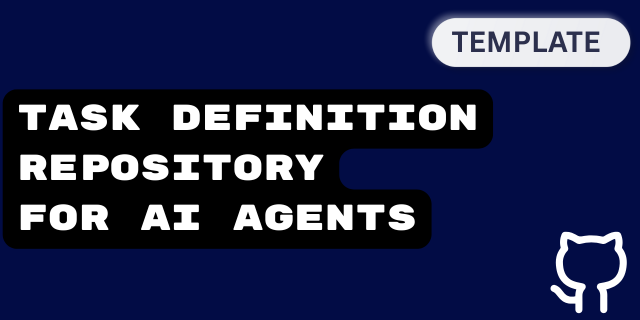

# AI Agent Task Repository Workflow

This diagram illustrates the workflow for using the AI Agent Task Repository Pattern with MCP.

 

## Workflow Steps Explained

### 1. Task Definition Phase
- **Human creates repository**: Initialize new task repo from template
- **Define specification**: Populate all template components (outline, details, remote, secrets, MCP, success criteria)
- **Collaborative review**: Optional stakeholder approval process
- **Version control**: Commit V1 of task definition

### 2. Preparation Phase
- **Library integration**: Optionally add to organizational task library
- **Agent instruction**: Simple prompt directing agent to task repository
- **Repository reading**: Agent parses all task components
- **MCP validation**: Verify required MCP servers are available

### 3. Execution Phase
- **Task execution**: Agent works through defined components
- **Progress logging**: Continuous documentation in logs/ directory
- **Iterative progress**: Execute → log → validate → continue cycle

### 4. Validation Phase
- **Success criteria check**: Validate against defined completion criteria
- **Human validation**: Final approval from task owner
- **Feedback integration**: Document lessons learned and improvements

### 5. Knowledge Management
- **Library updates**: Feed learnings back to organizational knowledge base
- **Continuous improvement**: Refine template and processes

## Key Benefits Highlighted

- **Modular approach**: Each step has clear inputs/outputs
- **Version control**: All task definitions are tracked
- **Collaborative support**: Built-in review and approval processes
- **Agent handoff**: Logging enables easy transitions between different LLMs
- **Organizational learning**: Knowledge accumulation and reuse
